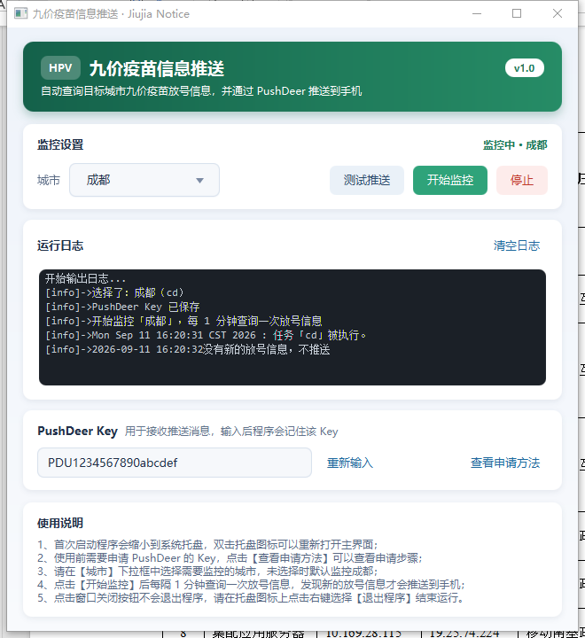
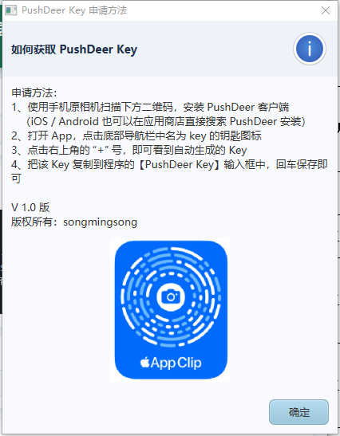

# 九价疫苗信息推送（jiujia-notice）

一个基于 JavaFX 的桌面小工具：定时查询指定城市的九价 HPV 疫苗放号信息，发现新的放号信息后通过
[PushDeer](https://www.pushdeer.com/) 推送到手机，程序常驻系统托盘，无需一直盯着电脑。

> 数据来源为第三方接口（本地宝），仅供个人参考，以官方渠道发布的信息为准。

## 功能特性

- **按城市查询**：内置 200+ 城市的城市代码（`src/main/resources/city.txt`），下拉框选择即可切换城市，默认成都。
- **自动轮询**：点击「开始监控」后每分钟查询一次，只有出现新的、预约时间尚未过期的放号信息才会推送。
- **自动去重**：推送内容与上一次完全相同时不重复推送，日志中提示「没有新的放号信息，不推送」。
- **测试推送**：不等待定时任务，立即查询一次并推送（不过滤已过期信息），方便验证 Key 与消息格式。
- **常驻托盘**：点击窗口关闭按钮不会退出，可在托盘图标右键选择「打开主界面 / 退出程序」。
- **Key 持久化**：PushDeer Key 保存在 `data.properties` 中，重启程序后点击「输入 Key」即可带出上次的值。
- **可视日志**：界面内嵌运行日志面板，自动滚动到最新一行，可一键清空。

## 界面说明

运行中的主界面：



主界面分为标题栏、监控设置、运行日志、PushDeer Key、使用说明五个区域：

- **标题栏**：程序名称、一句话说明与版本号。
- **监控设置**：右上角显示当前状态（未开始 / 监控中 / 已停止），下面是城市下拉框与「测试推送 / 开始监控 / 停止」三个按钮。
- **运行日志**：实时输出查询与推送结果，自动滚动到最新一行，右侧「清空日志」可一键清空。
- **PushDeer Key**：输入并保存推送 Key，右侧「查看申请方法」有申请步骤说明。
- **使用说明**：五条使用提示，窗口变窄时文字自动换行。

点击「查看申请方法」会弹窗显示申请步骤和安装二维码：



界面样式集中在 `src/main/resources/ui/app.css`，使用卡片式布局、绿色主题色，窗口可自由缩放（有最小尺寸限制），
缩放时日志区域自动伸展或收缩，不会出现内容被裁切的情况。

## 环境要求

| 项目 | 要求 |
| --- | --- |
| JDK | 1.8（JavaFX 随 JDK 8 一起提供，无需单独安装） |
| 操作系统 | Windows / macOS / Linux（需要系统托盘支持） |
| 其他 | 命令行可用 `curl`；Windows 10 1803 以后系统自带 |
| 账号 | 一个 PushDeer Key（在 App 内免费申请） |

第三方依赖：

| 依赖 | 版本 | 来源 |
| --- | --- | --- |
| fastjson2 | 2.0.29 | Maven 仓库 |
| okhttp / okio | 3.10.0 / 1.14.0 | Maven 仓库 |
| gson | 2.10 | Maven 仓库 |
| log4j / slf4j-api / slf4j-log4j12 | 1.2.17 / 1.7.10 / 1.7.10 | 项目 `lib/` 目录 |

## 快速开始

### 1. 申请 PushDeer Key

手机安装 PushDeer 客户端（iOS / Android 应用商店搜索 PushDeer），打开后点击底部 `key` 图标，
再点右上角 `+` 号即可看到生成的 Key。程序内点击「查看申请方法」也有同样的图文说明。

### 2. 使用 IntelliJ IDEA 运行

1. 用 IDEA 打开项目根目录（已包含 `jiujiaNotice.iml` 与 `.idea` 配置，SDK 选择 1.8）。
2. 依赖已在 `.idea/libraries` 中配置好，首次打开 IDEA 会自动从本地 Maven 仓库解析。
3. 运行 `src/main/java/com/sms/jiujia/Main.java`。
4. **不要在运行配置里加 `-Dfile.encoding=UTF-8`**：托盘右键菜单是 Windows 原生菜单，文字按 JVM 编码转换，
   一旦与系统编码（中文 Windows 是 GBK）不一致，中文就会显示成方框。保持默认即可，详见下方常见问题。

### 3. 使用命令行编译运行

以 Windows 为例（`;` 分隔 classpath，Linux/macOS 改为 `:`）：

```bash
# 编译
javac -encoding UTF-8 -cp "lib/*;<maven仓库>/com/alibaba/fastjson2/fastjson2/2.0.29/fastjson2-2.0.29.jar;<maven仓库>/com/squareup/okhttp3/okhttp/3.10.0/okhttp-3.10.0.jar;<maven仓库>/com/squareup/okio/okio/1.14.0/okio-1.14.0.jar;<maven仓库>/com/google/code/gson/gson/2.10/gson-2.10.jar" \
      -d out/production/jiujiaNotice $(find src/main/java -name "*.java")

# 复制资源文件
cp -r src/main/resources/* out/production/jiujiaNotice/

# 运行（需要程序目录可写，因为 Key 会写回 data.properties；不要加 -Dfile.encoding=UTF-8）
java -cp "out/production/jiujiaNotice;lib/*;<上述依赖 jar>" com.sms.jiujia.Main
```

### 4. 使用步骤

1. 启动后程序会缩到系统托盘，双击托盘图标打开主界面。
2. 点击「输入 Key」，粘贴 PushDeer Key 后回车（或点击输入框外部）保存。
3. 在「城市」下拉框中选择要监控的城市。
4. 点击「测试推送」验证配置；成功后点击「开始监控」，程序每分钟查询一次。
5. 退出请在托盘图标上右键选择「退出程序」。

## 目录结构

```
src/main/java/com/sms/jiujia/
├── Main.java                     程序入口（JavaFX Application）
├── ui/
│   ├── Home.java                 主界面布局（标题栏 / 卡片 / 日志 / Key / 说明）
│   └── setting/
│       ├── Constant.java         全局常量与运行状态（当前城市、定时器、消息模板等）
│       ├── Setting.java          界面控件注册表
│       └── HomeWindowSetting.java 窗口尺寸、最小尺寸与居中
├── event/HomeEvent.java          所有按钮、下拉框的事件处理
├── service/
│   ├── CurlTimer.java            定时任务：查询 -> 解析 -> 推送
│   └── LayoutConsoleLog.java     日志输出到界面 TextArea（支持同时写入日志文件）
├── model/                        接口返回数据的实体类
└── utils/
    ├── UtilTools.java            执行 curl、Unicode 解码、JSON 转换、城市表解析
    ├── PushMsgUtils.java         组装消息并调用 PushDeer 接口
    ├── TrayWindowUtil.java       系统托盘与窗口显示/隐藏
    ├── TimerTaskUtils.java       定时器创建
    ├── DataUtil.java             PushDeer Key 的本地持久化
    ├── LogUtils.java             全局日志实例
    ├── TextAreaPrint.java        把日志写入 TextArea 的 PrintStream
    └── DateUtils.java            日期格式化与比较

src/main/resources/
├── city.txt                      城市代码表（省份 / 城市名称 / 城市代号）
├── data.properties               PushDeer Key 持久化文件
└── ui/
    ├── app.css                   界面样式表
    └── OIP.png                   托盘图标（16x16 png）
```

## 工作原理

1. 点击「开始监控」后 `TimerTaskUtils` 创建定时器，1 秒后首次执行，之后每 60 秒执行一次 `CurlTimer`。
2. `CurlTimer` 通过 `ProcessBuilder` 调用 `curl` 请求本地宝接口，拿到 JSON 后交给 `UtilTools.coverJson` 转成实体类。
3. `PushMsgUtils` 合并 `website.place` 与 `onsitedate.place` 两个列表，过滤掉预约时间早于当前时间的记录，
   每条记录按 markdown 列表拼成一段（值为空的字段不显示）：
   ```
   **天府新区正兴社区卫生服务中心**
   - 预约时间：2024-02-05 08:30
   - 地址：四川天府新区正兴镇大安路519号
   - 数量：203人份
   - 方式：网上预约
   - 途径：四川预防接种公众号
   ```
4. 正文用 **POST 表单**提交给 PushDeer（自动做 URL 编码）；内容与上一次推送完全相同则判定「没有新的放号信息」，直接跳过。
5. 全过程写入界面日志面板。

## 配置说明

- **城市表**：`src/main/resources/city.txt`，每行格式为 `城市名称: 成都 城市代号: cd 所属省份: 四川`，
  解析时按 `": "` 切分成四段，第四段为省份（省份标题行会被自动忽略）。
- **轮询间隔**：`TimerTaskUtils` 中的 `60000L`（毫秒）。
- **默认城市**：`Constant.CITY`，默认 `cd`（成都）；界面会按该值选中下拉框，保证显示与实际查询一致。
- **推送内容格式**：`PushMsgUtils#buildPlaceBlock`（医院名称 + 预约时间/地址/数量/方式/途径，值为空则整行不显示）。
- **推送接口**：`Constant.PUSH_DEER_URL`，参数 `pushkey` / `text` / `desp` / `type=markdown` 以表单方式提交。
- **数据接口**：`HomeEvent#getCurlCmd()` 与 `Constant.CITY` 拼接。

## 常见问题

**中文乱码？**
界面和日志里的中文不受 `file.encoding` 影响，只要保证**编译**时按 UTF-8 解码即可：命令行用
`javac -encoding UTF-8`，IDEA 里把 `Settings → Editor → File Encodings` 都设为 UTF-8。

**托盘右键菜单是乱码/方框？**
托盘菜单是 AWT 原生菜单，文字由 JVM 按平台编码转换。如果启动参数里带了 `-Dfile.encoding=UTF-8`，
而系统编码是 GBK（中文 Windows 默认），中文就会被显示成方框。**去掉该参数即可恢复正常**。
程序启动时会检测这种不一致，此时自动把托盘菜单切换成英文，保证菜单始终可读、不会出现乱码
（日志里也会有提示）。

**点击「开始监控」提示需要输入 Key？**
PushDeer Key 没有输入或保存失败。点击「输入 Key」重新粘贴并回车保存，可先用「测试推送」验证。

**提示「没有新的放号信息，不推送」？**
说明本次查询结果里没有预约时间在当前时间之后的记录，或者与上次推送的内容完全一致，属于正常的去重逻辑，不是故障。
界面上的「测试推送」不做过期过滤，会展示查询到的全部信息，并标注「测试推送，未过滤已过期的信息」。

**提示推送失败？**
依次检查：Key 是否正确、网络是否可达 `api2.pushdeer.com`、PushDeer 客户端是否登录。
注意 PushDeer 在 Key 错误时同样返回 HTTP 200，程序是根据响应体里的 `code` 判断成功与否的，
所以失败时会直接把接口返回的原因显示出来（例如「推送失败：错误的Key」）。

**托盘图标不见了？**
程序启动时会隐藏到托盘。Windows 上可能被折叠进任务栏的隐藏图标区，展开即可看到。

## 已知限制

- 数据来自第三方接口，接口变更或下线会导致查询失败。
- PushDeer Key 通过 `getResource("data.properties").getFile()` 写回资源目录，因此**需要以目录形式运行**
  （如 IDEA 输出目录或上面的命令行方式）；打包成 jar 后 Key 的持久化会失败，需要改造为外部可写路径。
- 依赖本机 `curl` 命令，未安装时查询会失败。

## 免责声明

本项目仅用于个人学习与技术交流，数据来源于第三方公开接口。请勿用于商业用途或高频请求，
预约信息请以各地疾控中心、医院官方渠道为准。
